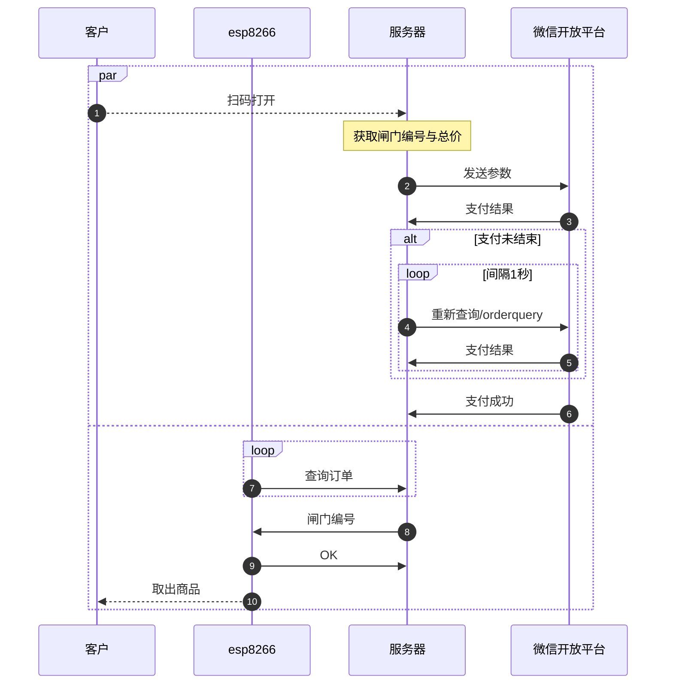
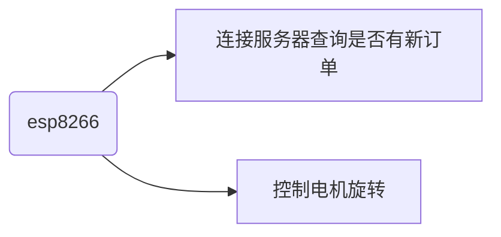
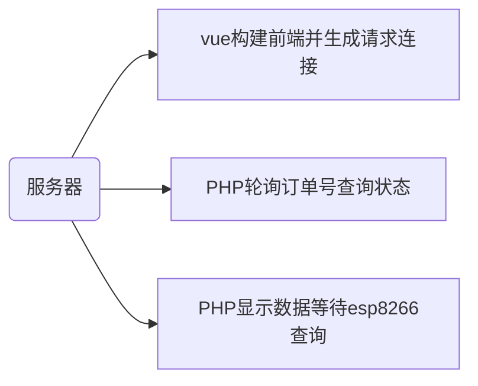

<!--
 * @Author: PlanC
 * @Date: 2022-12-10 17:19:43
 * @LastEditTime: 2022-12-13 20:17:44
 * @FilePath: \auto_vending\readme.md
-->

# 基于esp8266的自动售货机原型机
## 时序

```mermaid
sequenceDiagram
autonumber
    participant c as 客户
    participant e as esp8266
    participant s as 服务器
    participant w as 微信开放平台

    par
        c-->>s:扫码打开
        note over s:获取闸门编号与总价
        s->>w:发送参数
        w->>s:支付结果
        alt 支付未结束
            loop 间隔1秒
                s->>w:重新查询/orderquery
                w->>s:支付结果
            end
        end
        w->>s:支付成功
    and
        loop
            e->>s:查询订单
        end
        s->>e:闸门编号
        e->>s:OK
        e-->>c:取出商品
    end
```

## 计划
### esp8266

```mermaid
graph LR
e(esp8266)
e-->1[连接服务器查询是否有新订单]
e-->2[控制电机旋转]
```
### 服务器

```mermaid
graph LR
s(服务器)
s-->1[vue构建前端并生成请求连接]
s-->2[PHP轮询订单号查询状态]
s-->3[PHP显示数据等待esp8266查询]
```
